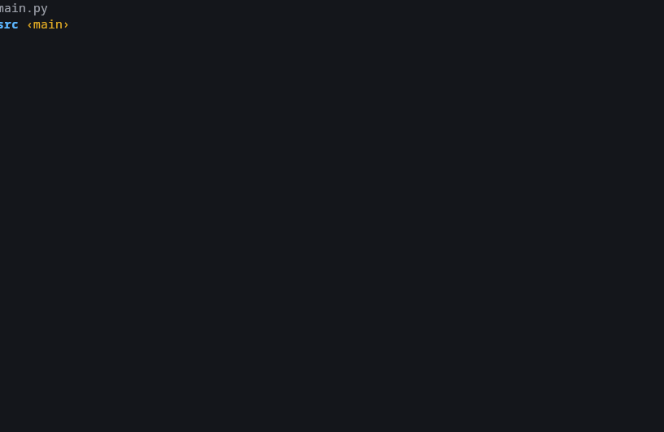

<p align="center">
  <a href="https://www.pygame.org/news" target="blank"></a>  
</p>

<h1 align="center"> Small game PyZombie </h1>

PyZombie is a minimalist 2D top-down shooter developed as a learning project. Built with Python’s Pygame library.



## Clone

> https://github.com/EduDevHe/small-game-py.git

## How to play

```bash
# Run PyZombie
python3 main.py
```

- Player movement using keyboard (Arrow Keys)
- Bullet shooting (Spacebar)

### requirements

- Python 3.7+
- Pygame

```bash
# Install Pygame
pip install pygame
```
